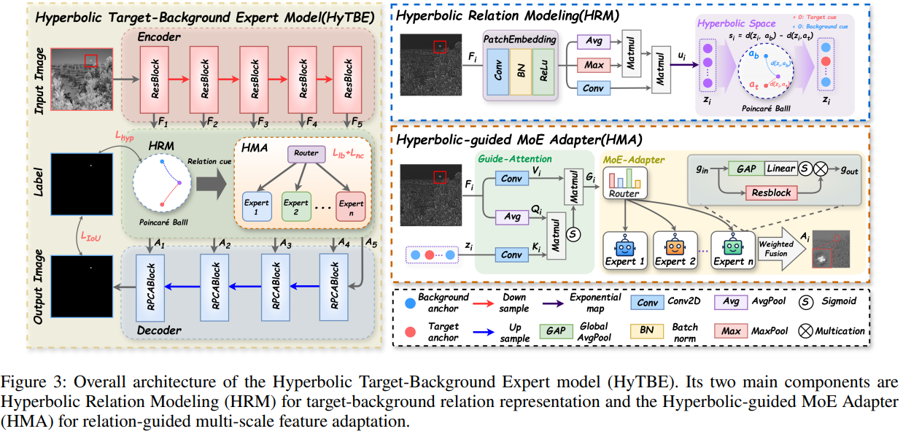
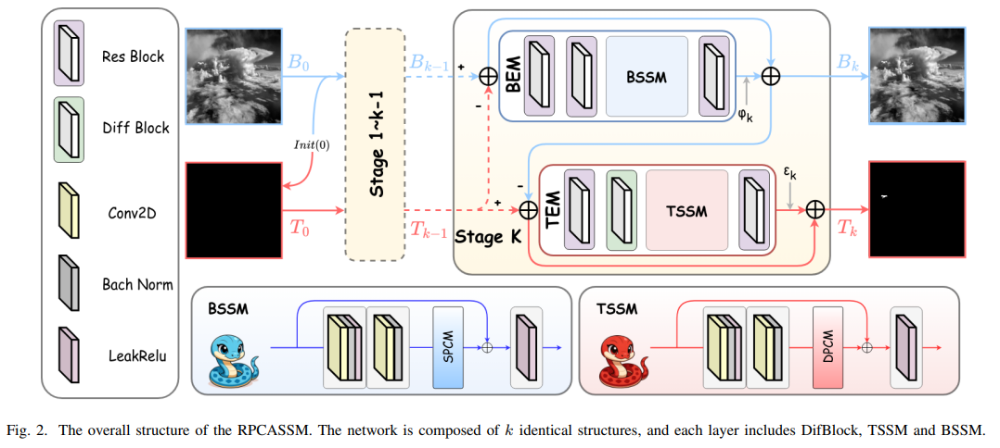
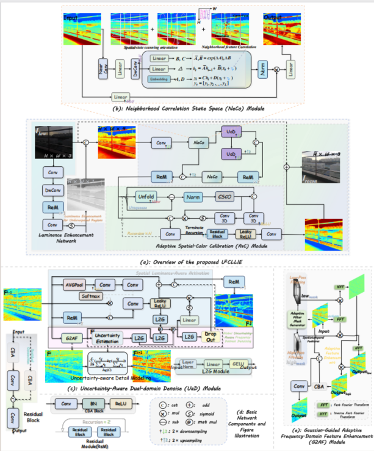
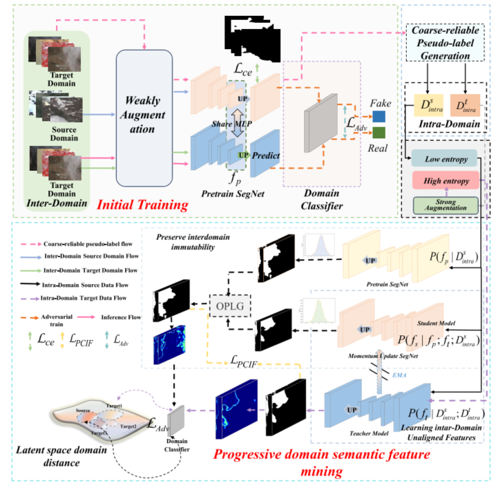
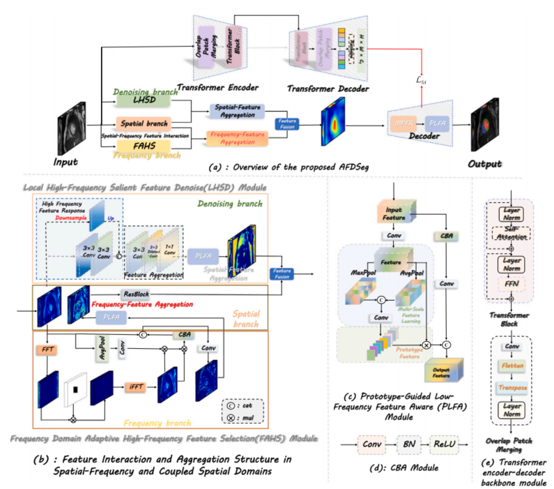
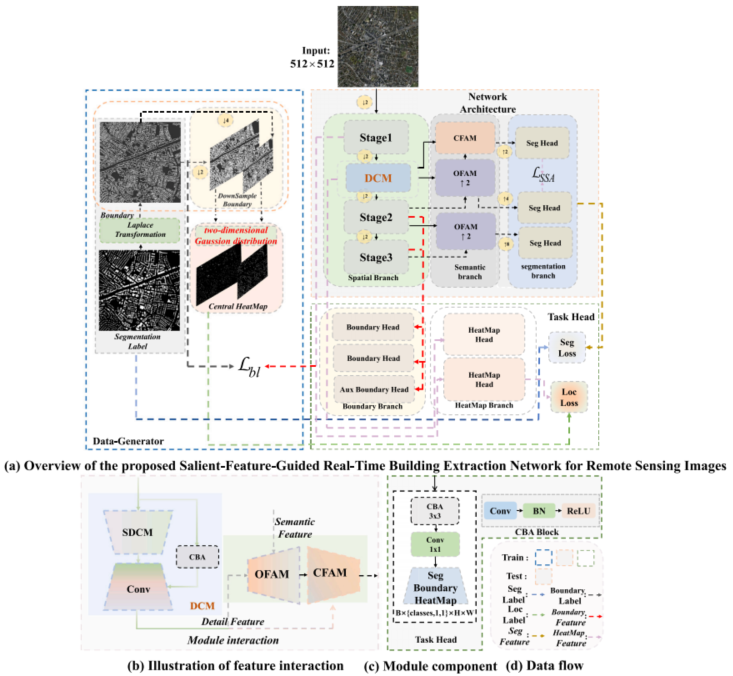
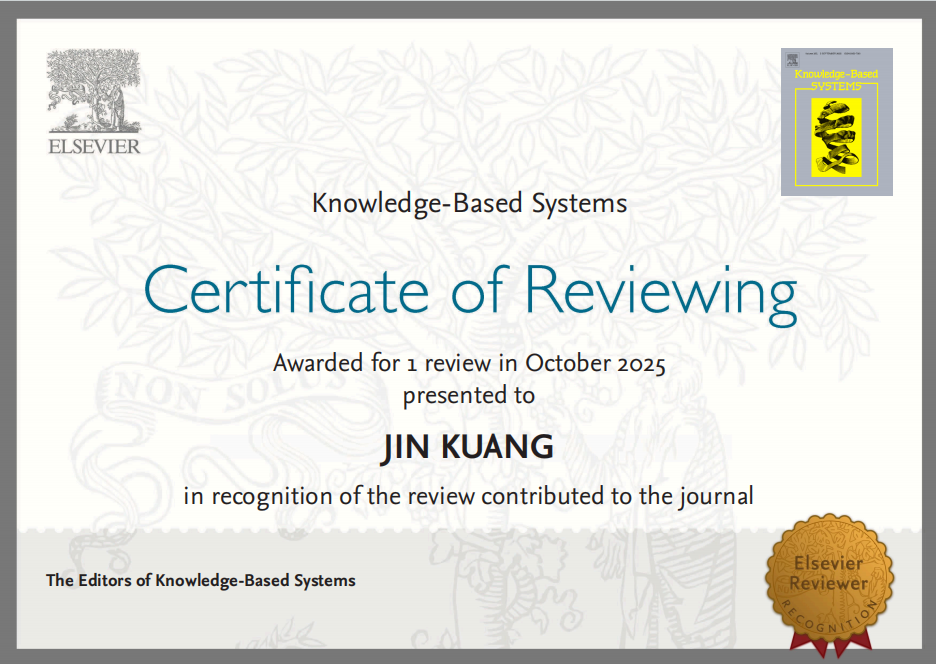

#  &#x1F393; About Me

I am currently pursuing a Ph.D. degree at the School of Computer Science and Engineering, Central South University(CSU), under the supervision of Prof. [Kehua Guo (郭克华)](https://faculty.csu.edu.cn/guokehua/zh_CN/index.htm). My current research focuses on **image representation learning in complex scenarios**, with particular interests in **low-light image enhancement** and **image restoration** under degraded conditions. Over the past several years, I have also worked as a **Research Assistant at the Hunan Provincial Engineering Research Center for Advanced Embedded Computing and Intelligent Medical Systems**, where I conducted research on high-level vision tasks, particularly semantic segmentation, as well as domain adaptation.

For collaborations or inquiries, please feel free to contact me via email.
#  &#128227; News
- *06/2025*: &nbsp; &#127881; &#127881; One paper about Segmentation (*Fourier-Based Learning for Medical Image Segmentation*) accepted to ***KBS 2025***.
- *05/2025*: &nbsp; &#127881; &#127881; One paper about Domain Adapation (*Uncertainty Entropy, Pseudo-Label learning*) accepted to ***TGRS 2025***.
- *04/2025*: &nbsp;  &#127881; &#127881; One paper about Segmentation (*Ultra-lightweight Semantic Segmentation for Remote Sensing Imagery*) accepted to ***KBS 2025***.

#  &#128218; Selected Publications
\* and † denote a corresponding author and an equal-contribution author, respectively.

Arxiv 2026

*HyTBE: Hyperbolic Target-Background Expert Model for Cross-Domain Infrared
Small Target Detection* [[PDF]]([https://www.arxiv.org/abs/2508.04176](https://arxiv.org/pdf/2608.05771)) [[Code]](https://github.com/PepperCS/HyTBE)

**Aohua Li**, Jin Kuang, Yubing Lu, Pingping Liu

Arxiv 2026

*RPCASSM: Robust PCA State Space Model For Infrared Small Target Detection* [[PDF]]([https://www.arxiv.org/abs/2508.04176](https://arxiv.org/pdf/2606.01689)) [[Code]](https://github.com/PepperCS/RPCASSM)

Pingping Liu, **Aohua Li**, Yubing Lu, Jin Kuang, Tongshun Zhang, Qiuzhan Zhou

Arxiv 2025

*Uncertainty-Aware Spatial Color Correlation for Low-Light Image Enhancement* [[PDF]](https://www.arxiv.org/abs/2508.04176) [[Code]](https://github.com/promisedong/U2CLLIE)

**Jin Kuang**, Dong Liu*, Yukuang Zhang, Shengsheng Wang

TGRS 2025

*PTDA: Progressive Pseudo-Label Learning for Cross-Domain Cloud Detection in High-Resolution Remote Sensing* [[PDF]](https://ieeexplore.ieee.org/document/10998457/) [[Code]](https://github.com/gasking/PTDA)

**Jin Kuang**, Xianjun Gao*, Yuanwei Yang, Siyuan Dong, Ji Dong, Yuan Kou, Meilin Tan, Zhiwei Wang

KBS 2025

*Adaptive frequency-domain enhanced deep model driven by heterogeneous
networks for medical image segmentation* [[PDF]](https://www.sciencedirect.com/science/article/abs/pii/S0950705125006458) [[Code]](https://github.com/promisedong/AFDSeg)

**Dong Liu**, Jin Kuang*,†

KBS 2025

*SFGNet: Salient-feature-guided real-time building extraction network for
remote sensing images* [[PDF]](https://www.sciencedirect.com/science/article/abs/pii/S0950705125004605) [[Code]](https://github.com/promisedong/SFGNet)

**Jin Kuang**, Dong Liu*

#  &#128269; Reviewer
- AAAI Conference on Artificial Intelligence (AAAI)
- ACM Multimedia (MM)
- IEEE Transactions on Circuits and Systems for Video Technology (TCSVT)
- Knowledge-Based Systems (KBS)
- 
<!-- 

 -->
